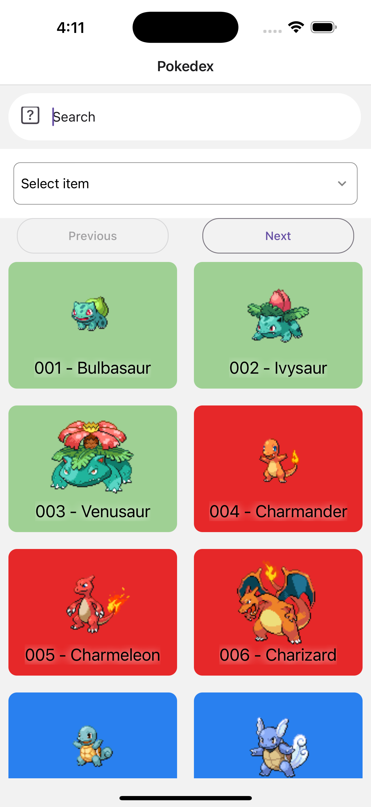

# Pokedex App

> # Home Screen  
>
> Aqui se muestra el listado de los pokemon con una barra de busqueda, al igual que dos botones, next y prev, para cambiar los pokemones listados.  
> Al dar click en un pokémon te dará los detalles de este mismo.
>
> 

> # Usando la barra de búsqueda
>
> La barra de busqueda tiene la funcionalidad para escribir por nombre o número de la pokedex y mostrarte el pokemon en cuestión
>
> 

> # Filtrando por tipos
>
> También si seleccionas el tipo por el cual filtra, tambien mostrará los pokemons que tengan ese tipo.
>
> 

> # Detail Screen
>
> En la pantalla de detalles se verán datos como el nombre, tipos, habilidades y estadisticas base del pokemon
>
> 
